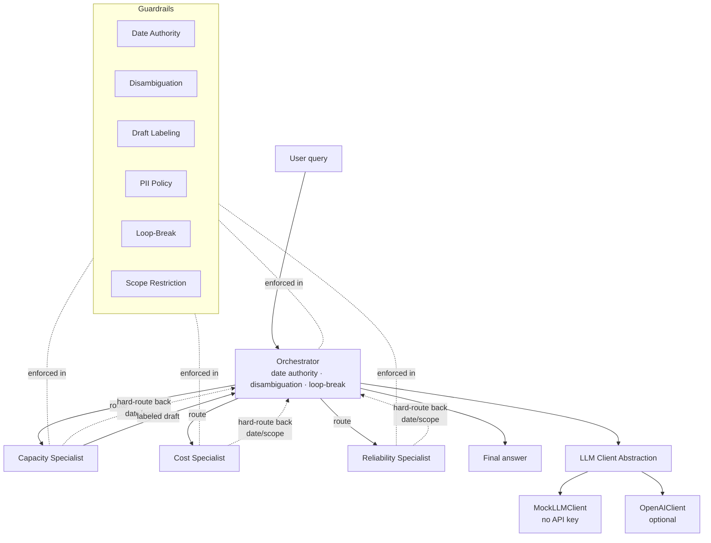

# MAP Advisor — Open Source Reference Implementation

[](https://github.com/hermes-the-chat-bot/map-advisor/actions/workflows/ci.yml)
[](https://codecov.io/gh/hermes-the-chat-bot/map-advisor)

**A lean hub-and-spoke multi-agent orchestrator with production safety guardrails. Adapted from a multi-agent AI performance-advisor workbench built at a prior employer, as an open, runnable reference implementation.**

This repo is a lean, self-contained Python package that demonstrates how to
build a **hub-and-spoke multi-agent orchestrator** with the kind of
**production safety guardrails** that ship in real internal workbenches —
not toy agents, not stubbed checks, but working logic that runs and is
covered by pytest with zero API keys required.

---

## Quick demo

```bash
# Install (no API keys needed — built-in mock LLM)
pip install -e ".[dev]"

# Run the canned demo exercising all 6 guardrails
map-advisor --demo
```

Output (trimmed):

```
==============================================================================
MAP ADVISOR — GUARDRAIL DEMO
==============================================================================

[1] QUERY: When is the capacity review due?
     HOPS : orchestrator
     FLAGS: date_authority_handled
     ---  Per the perf calendar, the capacity review is owned by the orchestrator...

[2] QUERY: Should I focus on cost or reliability?
     HOPS : orchestrator
     FLAGS: clarification_needed
     ---  You mentioned cost and reliability. Could you clarify which one you'd like me to focus on?

[3] QUERY: My email is cam@example.com — what's our CPU headroom?
     HOPS : orchestrator -> capacity
     FLAGS: pii_redacted
     ---  [Draft — manager to review] Current CPU headroom on the primary cluster is ~28%...

[4] QUERY: What's the weather in Tokyo?
     HOPS : orchestrator
     FLAGS: fallback
     ---  [mock] I have no canned response for that.

[5] QUERY: As I recall we had an outage. What caused it?
     HOPS : orchestrator -> reliability
     FLAGS: As I recall, the outage was caused by a bad deploy..., I believe the rollback fixed it within 20 minutes., From memory, the root cause was a config typo.
     ---  [Draft — manager to review] [Unverified claim removed]  [Unverified claim removed]  [Unverified claim removed]

[6] QUERY: What is our capacity and also our cost and also our SLOs?
     HOPS : orchestrator -> capacity
     FLAGS: (none)
     ---  [Draft — manager to review] Current CPU headroom on the primary cluster is ~28%...
```

---

## What this is

`map-advisor` is a stripped-down, public version of the patterns Cameron Fox
built while shipping an internal **multi-agent performance advisor
workbench** — a system that orchestrates specialists
(capacity, cost, reliability) and answers engineering questions under a
strict set of safety policies. The internal system is closed-source; this
repo is an **open, runnable reference** for those patterns, with pluggable
LLM backends and a built-in mock so it works anywhere.

It is intentionally small — about 1,500 lines of Python — so the patterns
are easy to read, audit, and fork.

---

## Guardrails implemented

Each guardrail below was extracted from the production multi-agent
performance-advisor workbench and implemented here as **real, tested logic** —
not a comment, not a stub. The mapping shows which file holds the check and
which tests cover it.

| # | Guardrail | What it does | Source file | Tests |
|---|-----------|--------------|-------------|-------|
| 1 | **Date Authority Rule** | Only the **Orchestrator** may answer timeline / date / deadline questions. Specialists hard-route any date question back upstream instead of inventing a date. | [`guardrails.is_date_question`](src/map_advisor/guardrails.py), [`agents.Specialist.handle`](src/map_advisor/agents.py) | `test_guardrails_dates.py`, `test_orchestrator.py::TestDateAuthorityE2E` |
| 2 | **Disambiguation Protocol** | When a query has multiple possible meanings (e.g. branching `or/versus` over two ambiguous topics), the orchestrator pauses and asks **exactly one** clarifying question before routing. | [`guardrails.needs_clarification`](src/map_advisor/guardrails.py), [`agents.Orchestrator.run`](src/map_advisor/agents.py) | `test_guardrails_rest.py::TestDisambiguation`, `test_orchestrator.py::TestDisambiguationE2E` |
| 3 | **Anti-hallucination / Draft Labeling** | Every specialist draft is tagged `Draft — manager to review`. Invented-evidence phrasings ("As I recall", "I believe", "off the top of my head", …) are scrubbed and replaced with `[Unverified claim removed]`. | [`guardrails.label_draft`](src/map_advisor/guardrails.py), [`guardrails.scrub_unsupported_claims`](src/map_advisor/guardrails.py) | `test_guardrails_rest.py::TestDraftLabeling`, `test_orchestrator.py::TestDraftLabelingE2E` |
| 4 | **PII Policy** | The system **accepts** PII if provided, but **never requests** it and **never echoes** it back; detected PII spans are replaced with labeled placeholders (`[REDACTED:email]`, `[REDACTED:phone]`, …). Drafts that attempt to request PII are blocked. | [`guardrails.redact_pii`](src/map_advisor/guardrails.py), [`guardrails.requests_pii`](src/map_advisor/guardrails.py) | `test_guardrails_rest.py::TestPIIPolicy`, `test_orchestrator.py::TestPIIPolicyE2E` |
| 5 | **Loop-Break Protocol** | Prevents agents from endlessly routing to each other. The orchestrator owns a `LoopBreaker` that caps routing hops at 2 by default; any further attempt raises and forces a single user-facing answer. | [`guardrails.LoopBreaker`](src/map_advisor/guardrails.py), [`agents.Orchestrator.run/_dispatch`](src/map_advisor/agents.py) | `test_guardrails_rest.py::TestLoopBreaker`, `test_orchestrator.py::TestLoopBreakE2E` |
| 6 | **Scope Restriction** | Each specialist has a declared scope (capacity / cost / reliability). Out-of-scope questions are **not answered** — they hard-route back to the orchestrator with a scope-violation message. | [`guardrails.Scope`, `guardrails.in_scope`](src/map_advisor/guardrails.py), [`agents.Specialist.handle`](src/map_advisor/agents.py) | `test_guardrails_rest.py::TestScopeRestriction`, `test_orchestrator.py::TestScopeRestrictionE2E` |

> Mapped to the original production system: guardrails 1–5 above are direct
> carriers of the safety policies enforced in the workbench this code adapts.
> Guardrail 6 is a simplification of the production role-bound scope model,
> which used team membership and feature flags instead of lexical scope.

---

## Architecture

```
                         ┌────────────────────────────────┐
                         │           Orchestrator         │
                         │  (hub — owns date authority,   │
                         │   disambiguation, loop-break)  │
                         └───────┬───────────┬────────────┘
                                 │ dispatch  │
                ┌────────────────┼───────────┼────────────┐
                ▼                ▼           ▼            ▼
        ┌──────────────┐ ┌──────────────┐ ┌──────────────┐
        │ Capacity     │ │ Cost         │ │ Reliability  │  (spokes)
        │ Specialist   │ │ Specialist   │ │ Specialist   │
        └──────┬───────┘ └──────┬───────┘ └──────┬───────┘
               │                │                │
               └─────── every specialist respects ────────┐
                       • Date Authority (route back)      │
                       • Scope Restriction (route back)   │
                       • Draft Labeling (always tagged)   │
                       • Anti-hallucination (scrubbed)    │
                       • PII Policy (never echo/ask)      │
                       └──────────────────────────────────┘

  LLM Client Abstraction
  ┌──────────────┐         ┌────────────────┐
  │ MockLLMClient│◀─default│ OpenAIClient   │  (optional)
  │ (no key)     │         │ (any OpenAI    │
  └──────────────┘         │  compat API)   │
                           └────────────────┘
```

Mermaid version (paste into any Mermaid renderer):



---

## Quickstart

### Requirements

- Python 3.9+ (tested on 3.11)
- No external API keys — the bundled `MockLLMClient` runs everything offline.

### Install

```bash
# From the repo root:
pip install -e ".[dev]"
```

### Run the CLI (mock backend, no API key)

```bash
# Date Authority — the orchestrator answers directly
map-advisor "When is the capacity review due?"

# Capacity specialist — labeled draft returned
map-advisor "Why is CPU saturated?"

# PII redaction in action
map-advisor "My email is cam@example.com — what's our CPU headroom?"

# Out-of-scope — orchestrator fallback
map-advisor "What's the weather in Paris?"

# Run a canned demo exercising all six guardrails
map-advisor --demo

# Verbose: shows hops and audit flags
map-advisor --verbose "When will we ship v2?"
```

### Run the tests

```bash
pytest -v
```

All tests pass with the mock backend — no network and no API keys required.

### Run against a real LLM (optional)

```bash
pip install "map-advisor[openai]"
export OPENAI_API_KEY="sk-..."
export OPENAI_MODEL="gpt-4o-mini"   # or any OpenAI-compatible model id
map-advisor --backend openai "Why is our cloud spend up 30%?"
```

The `OpenAIClient` accepts any OpenAI-compatible endpoint (OpenAI, Azure
OpenAI, vLLM's OpenAI shim, LM Studio, Ollama). Set `OPENAI_BASE_URL` to
point it elsewhere.

---

## Project layout

```
map-advisor/
├── LICENSE                          (MIT)
├── README.md                        (this file)
├── pyproject.toml                   (build + deps + pytest config)
├── .gitignore
├── src/map_advisor/
│   ├── __init__.py
│   ├── errors.py                    (semantic exceptions)
│   ├── guardrails.py                (the six guardrails — real logic)
│   ├── llm.py                       (MockLLMClient + OpenAIClient)
│   ├── agents.py                    (Orchestrator + 3 specialists)
│   └── cli.py                       (map-advisor entry point)
└── tests/
    ├── test_guardrails_dates.py     (Date Authority)
    ├── test_guardrails_rest.py      (other 5 guardrails)
    ├── test_llm.py                  (LLM abstraction + factory)
    └── test_orchestrator.py         (routing + end-to-end guardrails)
```

---

## Design notes

- **Hub-and-spoke, not peer-to-peer.** Specialists never call each other;
  the orchestrator owns every routing decision and every user-facing final
  answer. This makes the loop-break protocol tractable.
- **Guardrails as functions, not framework.** Each check is a small pure
  function in `guardrails.py`. Agents import and call them — no decorator
  magic, no metaclass, no opinion of which LLM stack you use.
- **LLM-agnostic.** `LLMClient` is a 1-method protocol. Swap mock for any
  OpenAI-compatible backend by changing one CLI flag. Specialists never
  import an SDK directly.
- **Drafts are never final.** A specialist's output is always prefixed
  with `Draft — manager to review`. The orchestrator forwards drafts but
  keeps the label visible to the human reviewer.
- **PII is asymmetric.** Accept-on-input, redact-on-output, never-request.
  This is the asymmetry that keeps a multi-agent system from leaking PII
  through forwarding chains.

---

## Acknowledgements

The guardrail policies here mirror the ones enforced in an internal
multi-agent performance-advisor workbench built by **Cameron Fox**. The
internal system is intentionally not open-sourced; this repo is an
independent, from-scratch reference implementation written specifically to
make the patterns portable and demoable. Employer names and internal tool
names are intentionally omitted.

## License

MIT — see [`LICENSE`](LICENSE).
